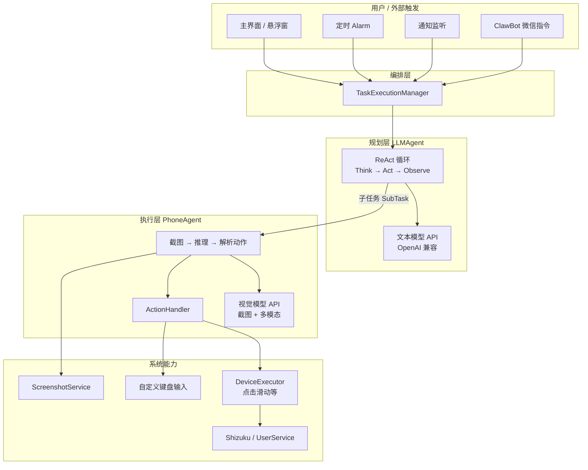
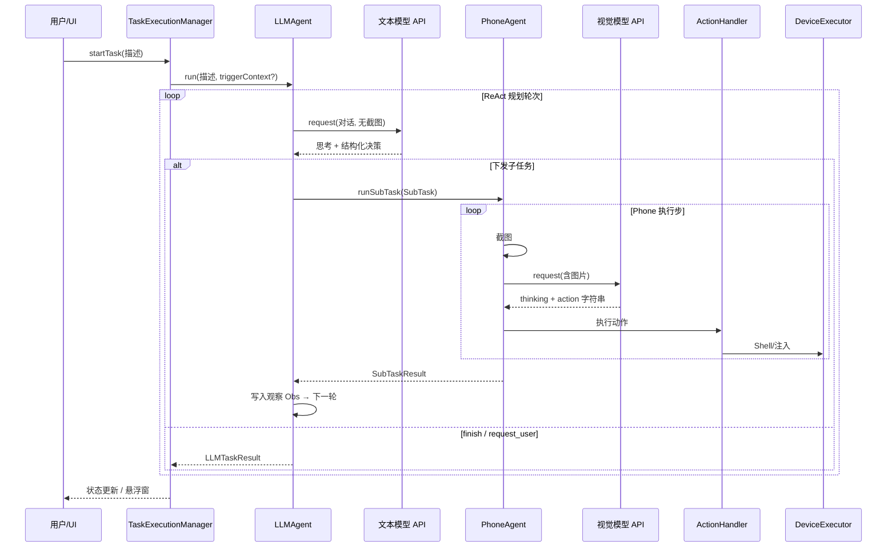
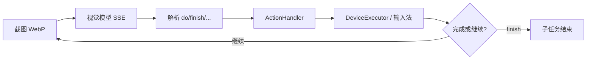
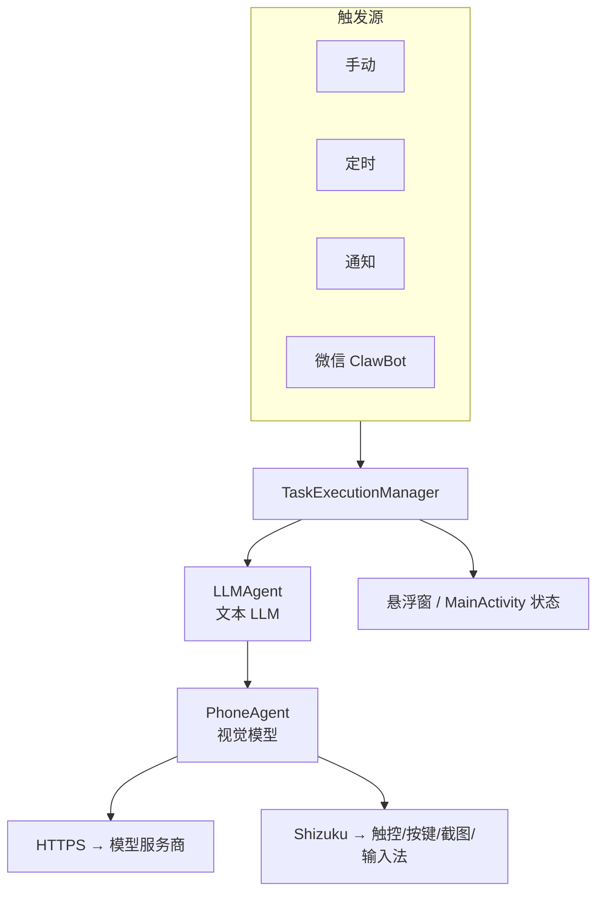

# Auto小二（AutoXiaoer）项目架构与技术梳理

> 面向希望「看懂全局、评估二改难度、自行打包 APK」的开发者。  
> **重要前提**：本仓库是 **Android 原生应用**，主体语言为 **Kotlin**，通过 HTTP 调用云端 **OpenAI 兼容的多模态 / 文本模型**。仓库内 **没有 Python 服务端代码**；若你是 Python 后端工程师，可重点关注下文「与后端思维的对应关系」和「二创时你可擅长的部分」。

---

## 1. 项目一句话定位

**Auto小二** 是在手机上运行的「视觉 + 语言」智能体：用户用自然语言描述任务，应用在本地截图、把图像发给「视觉模型」理解界面，再通过 **Shizuku** 获得 Shell 级能力执行点击、滑动、输入等操作；复杂任务由上层 **LLM（规划 Agent）** 拆成子任务，下层 **Phone Agent（执行 Agent）** 逐步完成。

 upstream 关系简述：

- 基于 [AutoGLM For Android](https://github.com/Luokavin/AutoGLM-For-Android) 深度修改；
- 思想上衔接 [Open-AutoGLM](https://github.com/zai-org/Open-AutoGLM)（原先偏 PC + ADB），本项目把自动化搬到手机端独立运行。

---

## 2. 技术栈总览

| 类别 | 选型 | 说明 |
|------|------|------|
| 平台 | Android API 24+，compileSdk 35，targetSdk 34 | `app/build.gradle.kts` |
| 语言 | Kotlin 2.x | JVM 11 |
| UI | Material、Navigation、Fragment、ViewModel、悬浮窗 Service | 原生 XML 布局为主 |
| 构建 | Gradle + AGP 8.x，`libs.versions.toml` 版本目录 | 输出 APK 名：`XiaoEr-{version}-{variant}.apk` |
| 网络 | OkHttp + SSE、`Retrofit`（依赖已引入） | `ModelClient` 调用模型 API |
| 序列化 | kotlinx.serialization | 请求/响应 JSON |
| 自动化底座 | Shizuku API | `UserService` / AIDL 与系统 Shell 交互 |
| 语音（离线） | sherpa-onnx | 可选语音识别相关功能 |
| 二维码 | ZXing | ClawBot 微信扫码登录 |
| 测试 | JUnit5 + Kotest Property + MockK | `app/src/test` |

---

## 3. 仓库与源码目录结构

```
AutoXiaoer/
├── app/
│   ├── build.gradle.kts          # 模块构建、签名、debug 复制 dev_profiles.json
│   └── src/main/java/com/flowmate/autoxiaoer/
│       ├── MainActivity.kt         # 主界面入口
│       ├── ComponentManager.kt     # 组件装配（近似简易 DI 容器）
│       ├── UserService.kt          # Shizuku 用户服务绑定
│       ├── agent/                  # LLMAgent（规划）、PhoneAgent（执行）、上下文与子任务
│       ├── action/                 # 动作解析与执行（点击、finish 等）
│       ├── model/                  # ModelClient、与 OpenAI 兼容 API 通信
│       ├── device/                 # DeviceExecutor（Shell 操作）
│       ├── screenshot/             # 截图服务
│       ├── input/                  # 自定义输入法、文本注入
│       ├── task/                   # TaskExecutionManager 任务总线、队列、触发上下文
│       ├── ui/                     # 悬浮窗、磁贴、状态
│       ├── settings/               # 设置持久化与界面
│       ├── history/              # 执行历史与详情
│       ├── schedule/               # 定时任务、Alarm、开机恢复
│       ├── notification/           # 通知监听与规则触发
│       ├── clawbot/                # 微信 ClawBot 长轮询与扫码
│       ├── voice/                  # 语音相关（Sherpa 等）
│       ├── config/                 # 系统 Prompt、国际化、LLM 规划 Prompt
│       └── util/                   # 日志、坐标、保活等
├── gradle/libs.versions.toml
├── README.md / develop_en.md       # 用户文档与英文开发说明
└── LICENSE                         # MIT（若你发布衍生作品需保留版权声明与许可全文）
```

说明：`develop_en.md` 中的目录树与当前代码「大体一致」；少数文件名以仓库为准（例如 `LLMAgent.kt` 等与规划层相关文件在 `agent/` 下）。

---

## 4. 核心架构：双 Agent + 集中装配

### 4.1 概念分层



### 4.2 组件职责（对应代码）

| 组件 | 文件（主要） | 职责 |
|------|----------------|------|
| **ComponentManager** | `ComponentManager.kt` | Shizuku 连上后创建 `DeviceExecutor`、`ScreenshotService`、`ActionHandler`、`PhoneAgent`、独立 `ModelClient` 的 `LLMAgent`；配置变更时可 `reinitializeAgents()` |
| **LLMAgent** | `agent/LLMAgent.kt` | 规划层 ReAct：纯文本对话调用 LLM，产出子任务交给 `PhoneAgent.runSubTask`；支持暂停/取消/重试 |
| **PhoneAgent** | `agent/PhoneAgent.kt` | 执行层：截图 → `ModelClient.request`（带图）→ `ActionParser` → `ActionHandler`；与历史记录、悬浮窗回调协作 |
| **ModelClient** | `model/ModelClient.kt` | 统一封装 OpenAI 风格 Chat Completions（含 SSE），Phone 与 LLM 各用一份配置实例 |
| **TaskExecutionManager** | `task/TaskExecutionManager.kt` | 单例：任务状态机、被动队列（通知合并、定时高优先级）、实现 `PhoneAgentListener` + `LLMAgentListener` 驱动 UI |
| **ActionHandler** | `action/ActionHandler.kt` | 把解析后的 `AgentAction` 落到真实设备操作 |

### 4.3 一次「用户点执行任务」的时序（简化）



### 4.4 PhoneAgent 单步子循环（执行层）



---

## 5. 任务来源与调度

| 触发方式 | 入口 | 行为要点 |
|----------|------|----------|
| 手动 | `TaskFragment` / 悬浮窗 | 直接 `startTask` |
| 定时 | `ScheduledTaskReceiver` + `AlarmManager` | `enqueueScheduledTask` 优先级 **HIGH**，可与通知队列合并策略见 `TaskExecutionManager` |
| 通知 | `AutoGLMNotificationListener` | 规则匹配后 `enqueuePassiveTask`，同包名+标题可合并文案 |
| 微信 | `ClawBotPollingService` + `ClawBotManager` | 长轮询收消息，转任务；与抢任务冲突时文档说明「不打断正在运行的任务」 |

---

## 6. 权限与系统依赖（为何必须 Shizuku）

- **Shizuku**：通过 `UserService`（`UserService.kt`）在非 Root 下获得足够权限执行 `input`、`screencap` 等（具体命令见 `DeviceExecutor`）。
- **悬浮窗**：`SYSTEM_ALERT_WINDOW`，前台 Service（`FloatingWindowService`）带 special use 类型。
- **通知监听**：`NotificationListenerService`，需用户在系统设置中手动授权。
- **开机与精确闹钟**：定时任务恢复、执行（`RECEIVE_BOOT_COMPLETED`、`SCHEDULE_EXACT_ALARM` 等）。
- **录音**：语音相关前台 Service（`FOREGROUND_SERVICE_MICROPHONE`）。

没有 Shizuku 时，`ComponentManager` 无法装配执行链，`LLMAgent` 也无法就绪（与 README 描述一致）。

---

## 7. 网络与模型配置

- **Phone Agent（视觉）**：`SettingsManager.getModelConfig()` → `ModelConfig`（baseUrl、apiKey、modelName 等），默认指向智谱等示例（见 README）。
- **LLM Agent（规划）**：`LLMAgentConfig` + 独立 `ModelClient` 实例（`ComponentManager.buildLLMModelClient`）。
- 二者 **API 完全独立**，可指向不同厂商。
- 请求形态：OpenAI 兼容 `/chat/completions`，多模态消息里含 `image_url`（base64）详见 `ModelClient` / `MessageDto`。

---

## 8. 构建与自行打包 APK

### 8.1 环境

- Android Studio Hedgehog+（或命令行 Android SDK + JDK 11+）
- 与 `develop_en.md` 一致：JDK 11、Kotlin 与 Gradle 由 Wrapper 锁定

### 8.2 常用命令（Windows 可用 `gradlew.bat`）

```bash
# Debug APK（默认 debug 签名）
./gradlew assembleDebug

# Release（若未放置 release.keystore 会回退 debug 签名，见 build.gradle.kts）
./gradlew assembleRelease
```

输出文件名在 `app/build.gradle.kts` 中配置为：`XiaoEr-${versionName}-${buildType}.apk`。

### 8.3 Release 正式签名（可选）

`app/build.gradle.kts` 中 `signingConfigs.release` 读取：

- `app/release.keystore` 文件存在时启用；
- 密码与别名来自环境变量：`KEYSTORE_PASSWORD`、`KEY_ALIAS`、`KEY_PASSWORD`。

无 keystore 时 release 仍可使用 debug 签名打包（适合内测，不适合上架商店）。

### 8.4 Debug 专属资源

若项目根目录存在 `dev_profiles.json`，仅在 **debug** 构建时复制到 `src/debug/assets/`，便于开发配置（不污染 release）。

---

## 9. 二创（二次创作）可行性 — 法律与技术

### 9.1 许可证

根目录 `LICENSE` 为 **MIT License**（Copyright 见文件内年份与署名）。MIT 允许：商用、修改、分发，条件通常为：**保留版权声明与许可全文**。若你还合并了上游 AutoGLM For Android 等代码，请同时遵守各上游许可证并保留相应声明。

### 9.2 技术与产品层面

| 维度 | 结论 |
|------|------|
| 能否 Fork 改 UI、改 Prompt、接自家模型 | **可以**，配置与 `SystemPrompts` / `LLMAgentPrompts` 等均可扩展 |
| 能否替换模型服务端 | **可以**，只要保持 OpenAI 兼容接口与多模态约定 |
| 能否改名、换包名上架 | **技术上可以**（改 `applicationId`、资源）；**上架政策**需你自行遵守应用商店与第三方服务条款 |
| 是否有服务端代码可部署 | **本仓库无独立 Python/Java 后端**；模型在你配置的远程 API |

---

## 10. 好不好改？— 给 Python 后端工程师的映射表

你熟悉的概念在本项目中的位置：

| 后端常见概念 | 本项目对应 |
|--------------|------------|
| HTTP 客户端 / SSE 流式响应 | `model/ModelClient.kt` |
| JSON Schema / 指令格式 | `action/ActionParser.kt`、`AgentAction.kt`、模型返回字符串约定 |
| 任务队列 / 优先级 | `TaskExecutionManager` 中 `passiveTaskQueue`、`TaskPriority` |
| 策略与 Prompt | `config/SystemPrompts.kt`、`config/LLMAgentPrompts.kt` |
| 审计与日志 | `util/Logger.kt`、`LogFileManager.kt`、历史 `HistoryManager.kt` |

**修改门槛诚实评估**：

- **偏「策略、协议、Prompt、队列规则」**：阅读 Kotlin 即可增量改，与后端思维接近。
- **偏「Android UI、Service、权限、Shizuku」**：需要补充 Android 生命周期与系统机制知识，学习曲线比纯改 Prompt 陡。
- **本项目约 85 个 Kotlin 主源码文件**，模块边界清晰，从 `ComponentManager` + `TaskExecutionManager` + `LLMAgent` + `PhoneAgent` 四条线切入最高效。

---

## 11. 风险与合规提示（摘自 README 思想）

- 安全边界依赖 **模型 Prompt**，非硬件级沙箱；勿用于高危资金/隐私场景。
- 截图会发往 **你配置的模型服务商**，需信任其隐私政策。
- 敏感界面可能出现黑屏截图（系统策略）。

---

## 12. 推荐阅读顺序（上手调试）

1. `README.md` — 功能与用户路径  
2. `ComponentManager.kt` — 依赖关系全貌  
3. `task/TaskExecutionManager.kt` — 任务从进入到结束的调度  
4. `agent/LLMAgent.kt` — 规划循环如何调用 `PhoneAgent`  
5. `agent/PhoneAgent.kt` — 截图—模型—执行闭环  
6. `model/ModelClient.kt` — API 细节  
7. `action/ActionHandler.kt` + `device/DeviceExecutor.kt` — 动作如何落地  

---

## 13. 附录：架构示意图（一页纸）



---

**文档版本**：基于仓库当前结构梳理（Gradle、`ComponentManager`、`TaskExecutionManager`、`LLMAgent`、`PhoneAgent`、`ModelClient`、`AndroidManifest`）。若你后续升级依赖或重构模块名，请以代码为准更新本章对应路径。
