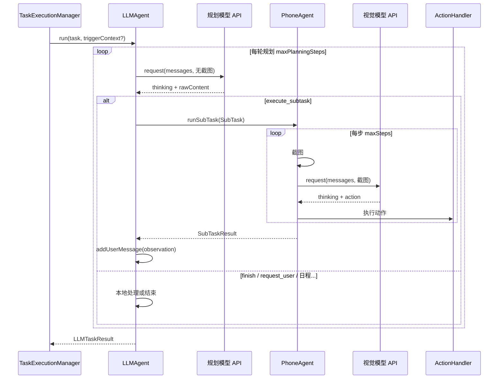

# Phone Agent 与 LLM Agent 协作机制详解

本文档基于仓库当前实现，说明 **规划层（LLMAgent）** 与 **执行层（PhoneAgent）** 如何分工、如何通过数据结构与调用链配合完成用户任务，并补充配置、UI、历史记录与边界行为说明。

---

## 1. 总览：双 Agent 架构在做什么

Auto小二将自动化拆成两层：

| 角色 | 类 | 典型模型 | 输入 | 输出 |
|------|-----|----------|------|------|
| **规划 Agent（大脑）** | `LLMAgent` | 任意兼容 OpenAI Chat Completions 的**纯文本**模型（如 GLM-4、DeepSeek） | 多轮**纯文本**对话（系统提示 + 用户任务 + 子任务观察） | 结构化 `<action>` JSON：拆分子任务、结束任务、通知用户、管理日程等 |
| **执行 Agent（手）** | `PhoneAgent` | 面向 UI 的**视觉**模型（如 `autoglm-phone`） | **当前屏幕截图** + 对话上下文 | 动作 DSL（点击、滑动、输入等），经 `ActionHandler` 落到真实设备 |

二者通过 **`SubTask` / `SubTaskResult`** 传递「要做什么」与「做得怎样」，整体模式接近 **ReAct：Think → Act → Observe**，其中 **Act** 在复杂场景下由 PhoneAgent 在子任务内部再跑自己的「截图 → 推理 → 执行」小循环。

### 1.1 常见误解：Phone Agent 是否在「再做一层规划」？

**不完全是。** 容易把执行层想成「拿着 LLM 的计划表再做一遍顶层设计」，但代码里的分工更接近下面这张对照表：

| 层级 | 更像什么 | 实际在做什么 |
|------|----------|----------------|
| **LLM Agent** | 项目经理式的高层规划 | 理解**整条用户任务**，拆成**子任务**（每次一个 `execute_subtask`），必要时预生成要上屏的文案；**不看截图**，只靠纯文本对话里的任务描述与子任务**结果摘要**推进。 |
| **Phone Agent** | 带视觉的逐步操作 | 只接收**当前这一条**子任务说明（及 `preGeneratedTexts` 拼进任务正文的附录），在子任务内循环：**截图 → 视觉模型看屏 → 产出当前这一步的动作** → 执行 → 再截图……直到本子任务 `finish` 或失败。 |

要点：

- Phone **不会**拿到 LLM 的完整多轮规划或 JSON「总计划」，只拿到**一段自然语言子任务**（增强描述里会附带预生成键值说明）。
- 子任务内部**每一步**视觉模型都会在「当前截图 + 上下文」上做**局部推理**，决定下一步点哪、滑哪、是否结束本子任务——这像一种**短视界的感知–行动闭环**，而不是再为**整用户任务**做一次全局拆解；**全局拆几步、每步目标是什么**已在 LLM Agent 侧完成。

若用一句话概括：**LLM 负责「拆到哪一步、这一步要达成什么」；Phone 负责「看着屏幕把这一步做出来」。**

---

## 2. 依赖装配：两个模型、两个 `ModelClient`

`ComponentManager` 在 Shizuku 连接后初始化执行链，并刻意把**规划模型**与**视觉模型**拆开：

- **PhoneAgent** 使用 `settingsManager.getModelConfig()` 构建的 `ModelClient`（视觉任务、带图请求）。
- **LLMAgent** 使用 `buildLLMModelClient(llmAgentConfig)` 构建的**另一份** `ModelClient`（`LLMAgentConfig`，与 `ModelConfig` 字段独立）。

因此：**底座 URL、API Key、模型名都可以完全不同**；规划用强文本模型、执行用专用 phone 模型是官方设计。

相关代码：`ComponentManager.initializeServiceDependentComponents()` 中先创建 `PhoneAgent(..., modelClient = modelClient, ...)`，再创建 `LLMAgent(..., modelClient = llmModelClientInternal!!, phoneAgent = phoneAgentInternal!!, ...)`。

---

## 3. 任务入口：谁启动整条链路

应用内统一由 **`TaskExecutionManager.startTask`** 启动任务（手动、悬浮窗、通知规则、定时闹钟、ClawBot 等均汇聚于此）。

要点：

1. **必须**同时存在 `phoneAgent` 与 `llmAgent`（二者都依赖 Shizuku 已连接并完成组件初始化）。
2. `startTask` 在协程中调用 **`llmAgent.run(description, triggerContext)`**，而不是直接 `phoneAgent.run(...)`。
3. 也就是说：**用户层面的「一个任务」在代码路径上总是先进入 LLM 规划层**；是否再调用 PhoneAgent，由 LLM 每轮输出的 `action.type` 决定。

---

## 4. LLMAgent：ReAct 主循环（Think → Act → Observe）

### 4.1 生命周期与上下文

- 每次 `run()` 可根据 `LLMAgentConfig.maxTaskRetries` **整任务重试**若干次；**用户取消**不会重试。
- 单次尝试在 `runOnce()` 中执行：
  - `historyManager?.startTask(taskDescription)`：**由 LLM 侧开启一条任务历史**（与下文 Phone 子任务的关系见第 8 节）。
  - 构造 `LLMAgentContext(systemPrompt)`：仅文本消息，**从不附带截图**（与 `PhoneAgentContext` 对称设计）。
  - 首条用户消息 = 日期时间前缀 + `【用户任务】` + 可选 **`TriggerContext`**（通知原文、日程背景、ClawBot 说明等）。

### 4.2 每一轮「规划」做了什么

在 `round < maxPlanningSteps` 的循环内：

1. **边界检查**：取消、暂停（`pauseRequested` 时每 200ms 自旋等待恢复）。
2. **Think**：`modelClient.request(context.getMessages(), currentScreenshot = null)` —— **纯文本**调用规划模型。
3. 网络失败时：**等待约 10 秒后重试一次**；仍失败则本 attempt 失败返回。
4. 成功则取 `response.thinking` 通知监听者，将 **`response.rawContent` 整段写入上下文**（assistant 一条）。
5. **Parse**：从原始内容中解析 **第一个 `<action>...</action>` 块** 内的 JSON（`parseAction`）。解析失败则向上下文注入纠错用户消息并 **continue** 同一轮不增加业务语义上的「成功轮次」——实际是同一 `round` 内重试输出格式。
6. **Act**：根据 `type` 分支处理（见下一节）。
7. 若未 `finish` / 未失败 / 未超轮次，循环继续，模型在**已包含子任务观察**的更长上下文中再次 Think。

### 4.3 规划层支持的 `action.type` 一览

| `type` | 含义 | 是否与 PhoneAgent 交互 |
|--------|------|------------------------|
| `execute_subtask` | 下发一个子任务给执行层 | **是**，核心协作路径 |
| `finish` | 认为整体任务完成 | 否，结束 `runOnce` 并成功 |
| `request_user` | 向用户发消息（并可接 ClawBot） | 否（走消息通道）；成功后仍把结果写回上下文，**任务不自动结束** |
| `schedule_task` / `query_scheduled_tasks` / `update_scheduled_task` / `delete_scheduled_task` | 日程 CRUD | 否，本地 `ScheduledTaskManager` |

与 Phone 无关的动作让「大脑」能管理日程、发微信通知，而**触屏操作**集中在 `execute_subtask`。

---

## 5. `execute_subtask`：从 JSON 到 `SubTask` 再到 Phone

### 5.1 JSON 与 `SubTask` 字段

`parseAction` 在 `type == execute_subtask` 时读取：

```json
{
  "type": "execute_subtask",
  "subtask": {
    "description": "给执行层的自然语言说明",
    "preGeneratedTexts": {
      "用途说明": "需要输入到手机上的原文"
    }
  }
}
```

映射为 `SubTask(id, description, preGeneratedTexts)`：

- **`id`**：实现里用 `System.currentTimeMillis().toInt() and 0xFFFF` 生成短时唯一值（与注释中「序号」略有出入，但对 `SubTaskResult` 回传足够）。
- **`preGeneratedTexts`**：可选；用于「打字内容已由规划模型写好，执行模型只负责点选与粘贴」。

### 5.2 `PhoneAgent.runSubTask`

1. **`buildEnhancedTaskDescription`**：在 `description` 后追加一段说明，列出各 key 的预生成文案，并标明「预生成内容——直接使用，不要自行生成」（中英文分支）。
2. 调用 **`run(enhancedTask, initHistory = false)`**：
   - **`initHistory = false`** 表示：不在 Phone 内再次 `historyManager.startTask` / `completeTask`，避免与 LLM 侧已开启的**同一条任务历史**冲突；但执行过程中的 **`recordStep`、截图缓存等仍可按 HistoryManager 设计写入**（与顶层 `startTask` 由 LLMAgent 负责配对）。
3. Phone 内部仍是「多步」：`executeStep` 循环直到 `finish`、失败、取消、达 `maxSteps` 等。
4. 返回 **`SubTaskResult`**：`success`、`summary`（来自 Finish 或错误文案）、`stepCount`、`failureReason`、`needsUserTakeOver`（消息是否以 `请求手动接管` 前缀开头）、以及最后一步的思考/动作摘要，供下一轮规划使用。

### 5.3 观察消息（Observe）如何回到 LLM

`LLMAgent.buildObservationMessage` 根据成功 / 失败 / 需用户接管 组装中文结构化「子任务执行结果」段落，通过 **`context.addUserMessage(observation)`** 写回。

随后 `historyManager?.recordPlanningRound(LLMPlanningRound(...))` 记录本轮规划（含子任务描述、观察摘要、是否成功等）。

接着 **while 循环进入下一轮**，模型看到的是：之前所有 assistant/user 轮次 + **刚追加的观察**，从而决定继续 `execute_subtask`、`finish`、`request_user` 或改日程。

---

## 6. PhoneAgent：子任务内部的执行闭环

在 `runSubTask` 触发的 `run(..., initHistory = false)` 中，每一步大致为：

1. **状态**：从 `IDLE` CAS 到 `RUNNING`；若已有任务在跑则直接拒绝（子任务串行依赖 LLM 侧一次只派一个）。
2. **延迟**：`screenshotDelayMs` 后截图（减少动画中间态）。
3. **截图**：`ScreenshotService` → base64 等传入 `ModelClient.request(..., screenshot, maxResponseLength)`。
4. **用户消息文案**：
   - 第一步：`任务: {增强后的子任务全文}\n当前屏幕截图如下:`
   - 后续步：`上一步执行结果: {hint}\n继续执行任务...` 或 `继续执行任务...`
5. **模型返回**：解析 thinking + action，**`ActionParser` + `ActionHandler`** 执行真实操作；`listener` 回调用于悬浮窗/列表 UI。
6. **结束条件**：某步返回 `finished`、失败、`CANCELLED`、`maxSteps` 等，汇总为 `TaskResult`，再封装为 `SubTaskResult`。

与 LLM 的关键差异：**每一步都带当前截图**；上下文由 `SystemPrompts`（执行层人设）驱动，与 `LLMAgentPrompts`（规划层人设）分离。

---

## 7. 系统提示与职责划分（Prompt 层协作）

### 7.1 `LLMAgentPrompts`（规划）

- 明确「你有一只手叫 phone-agent」「复杂指令要拆解」「每次只派一个子任务」。
- 规定输出格式：`<think>...</think>` + `<action>{ JSON }</action>`。
- **`preGeneratedTexts`**：凡涉及输入文字，由规划模型生成，执行层照抄，减轻小模型造句负担、避免风格不一致。

### 7.2 `SystemPrompts`（执行）

- 面向单屏操作与 autoglm-phone 类动作空间，与规划层无直接代码耦合，仅通过 **子任务自然语言描述 + 预生成附录** 接收高层意图。

### 7.3 实现细节提示（供调试）

- 中文默认提示中思考标签为 **`<think>`**，而 `LLMAgent.extractThinking` 曾尝试解析 `<think>`（当前主流程使用 **`response.thinking`** 来自模型客户端解析，以实际 API 返回为准）。若仅依赖标签解析展示思考，需注意与接口返回字段一致。

---

## 8. 历史记录与 UI：同一条任务上的两层步骤

- **任务级**：`LLMAgent.runOnce` 开始处 `historyManager.startTask`；`finish` / 失败 / 取消时 `completeTask`。
- **规划轮次**：`recordPlanningRound(LLMPlanningRound(...))` 在子任务完成或日程等动作后写入。
- **执行步**：PhoneAgent 在子任务内 `recordStep`（不重复 `startTask`）。

**`TaskExecutionManager`** 同时实现 `PhoneAgentListener` 与 `LLMAgentListener`，在 Shizuku 就绪后轮询注册监听：

- **LLM 轮次**：`onPlanningRoundStarted` 追加 `StepSource.LLM_AGENT` 的步骤；`onSubTaskStarted` 把该步的 `action` 显示为 `▶ 子任务描述`；`onObservationReceived` 写入观察文本。
- **Phone 步**：`onStepStarted` / `onThinkingUpdate` / `onActionExecuted` 更新瀑布流，来源为 `PHONE_AGENT`（悬浮窗里用不同颜色区分）。

因此用户在同一次任务中可看到：**规划思考 → 派发子任务 → 多步截图操作 → 观察结果 → 下一轮规划** 的交错时间线。

---

## 9. 暂停、取消与并发语义

- **暂停**：`TaskExecutionManager.pauseTask()` 先 `llmAgent.pause()` 再 `phoneAgent.pause()`，避免规划层在暂停期间又派发新子任务；恢复时先 `phoneAgent.resume()` 再 `llmAgent.resume()`。
- **取消**：`cancelTask()` 同时 `llmAgent.cancel()`（会 `modelClient.cancelCurrentRequest()`）与 `phoneAgent.cancel()`。
- **Phone 单实例互斥**：`runSubTask` 走 `run()`，若执行层已在跑会直接失败；正常路径下 LLM 顺序调用，不并发多个子任务。

---

## 10. 端到端时序（简化）



---

## 11. 实际案例：给微信好友「张三」发一条固定问候（逐步对照代码行为）

下面用一个**虚构但贴近真实 UI** 的例子，把「规划层说了什么 → 执行层做了什么 → 观察怎么写回 → 规划层如何收尾」串成一条完整故事线。其中的模型原文为**示意**，真实措辞以各模型为准；**数据流与调用顺序**与当前实现一致。

### 11.1 用户输入与首轮上下文

用户在任务框输入：

> 打开微信，找到好友「张三」的聊天窗口，发送一条消息：「晚上好，今天辛苦了 🙂」

`TaskExecutionManager.startTask` 调用 `llmAgent.run(...)` 后，`LLMAgent.runOnce` 会：

1. `historyManager.startTask(...)` 开启本条任务历史。
2. 向 `LLMAgentContext` 追加首条 **User** 消息，大致形如：  
   `【当前时间】…` + `【用户任务】` + 上述自然语言 + `请开始规划并执行此任务。`  
   （无截图。）

### 11.2 规划轮次 1：只导航，不生成输入正文

**Think（规划模型，纯文本请求）**  
规划模型根据系统提示判断：发微信需要先打开应用并进入指定会话；**输入框里的长句应由规划层预生成**，执行层只负责点按与粘贴。因此第一轮它输出（示意）包含：

```xml
<think>
1. 【任务全貌】打开微信 → 进入与张三的聊天 → 发送指定文案
2. 【已完成】无
3. 【待完成】先完成「打开微信并进入张三聊天」
</think>
<action>
{
  "type": "execute_subtask",
  "subtask": {
    "description": "打开微信应用，在聊天列表中找到昵称为「张三」的好友，点击进入与他的单聊会话界面。不要发送消息，到达聊天界面后结束本子任务。",
    "preGeneratedTexts": {}
  }
}
</action>
```

**Act（`LLMAgent`）**  
- 解析 `<action>` → `execute_subtask` → 构造 `SubTask`（`preGeneratedTexts` 为空）。  
- 调用 `phoneAgent.runSubTask(subTask)`。

**Phone 子任务 1 内部（执行层多步）**  
`runSubTask` → `buildEnhancedTaskDescription` 仅追加描述（无预生成附录）→ `run(..., initHistory = false)`。Phone 可能经历例如：

| 执行步 | 执行层在做什么（概念上） |
|--------|---------------------------|
| Step 1 | 截图：桌面 → 视觉模型 → 点击微信图标 |
| Step 2 | 截图：微信首页 → 滑动/搜索列表 → 点击「张三」 |
| Step 3 | 截图：已进入与张三的会话 → `finish(...)` 类动作，子任务成功结束 |

**Observe（写回规划层）**  
Phone 返回 `SubTaskResult(success=true, summary=最后一步的 Finish 文案, stepCount=3, ...)`。  
`LLMAgent.buildObservationMessage` 生成一段 **新的 User 消息**（示意结构）：

```text
【子任务执行结果】
步骤 …「打开微信…」已成功完成。
执行了 3 个操作步骤。
结果摘要：<Phone 的 Finish 消息>

请根据上述结果决定下一步操作。
```

该字符串通过 `context.addUserMessage(observation)` 进入下一轮对话；同时 `recordPlanningRound` 记下本轮与子任务结果。

### 11.3 规划轮次 2：带 `preGeneratedTexts`，执行层只「打字」

此时规划模型**看不到截图**，但能从观察里读到「已在张三的聊天界面」。它输出第二轮 `execute_subtask`，例如：

```json
{
  "type": "execute_subtask",
  "subtask": {
    "description": "在当前微信聊天界面中：点击输入框，将预生成内容作为一条消息发送出去，发送成功后结束本子任务。",
    "preGeneratedTexts": {
      "回复内容": "晚上好，今天辛苦了 🙂"
    }
  }
}
```

**Act**  
再次 `phoneAgent.runSubTask`。**增强任务描述**会在正文后追加（中文环境下）：

```text
【预生成内容——直接使用以下内容，不要自行生成】
- 回复内容：「晚上好，今天辛苦了 🙂」
```

执行层视觉模型据此更倾向于输出 **Type/发送** 等与预置文案一致的动作，而不自己编句子。

**Observe**  
若发送成功，同样会得到成功观察消息；若失败（例如网络发送失败、找不到发送按钮），观察里会带 `失败原因`、`最后执行的操作` 等（见 `buildObservationMessage` 失败分支），规划模型在**第三轮**可重试子任务、`request_user` 或 `finish` 说明情况。

### 11.4 规划轮次 3：`finish` 结束整条任务

规划模型读到第二次观察为成功，输出：

```json
{ "type": "finish", "message": "已向张三发送问候消息「晚上好，今天辛苦了 🙂」。" }
```

`LLMAgent` 走 `ACTION_FINISH` 分支：`historyManager.completeTask(true, ...)`，回调 `onTaskFinished`，`runOnce` 返回 `LLMTaskResult(success=true, ...)`。`TaskExecutionManager` 将任务标为完成。

### 11.5 本例在 UI 上的观感（与第 8 节呼应）

同一次任务里，悬浮窗/步骤列表大致呈：

1. **LLM_AGENT** 条：规划思考 + `▶ 打开微信…`（子任务标题）+ 观察摘要。  
2. 其下多条 **PHONE_AGENT** 条：子任务 1 各步的 thinking / 点击等。  
3. 再一条 **LLM_AGENT**：第二轮规划 + `▶ 输入并发送…` + 观察。  
4. 再若干 **PHONE_AGENT**：子任务 2 各步。  
5. 最后 **LLM_AGENT**：`finish` 对应总结（若界面展示最终消息）。

### 11.6 本例体现的设计要点

- **一次只派一个子任务**：打开会话与发送消息拆成两轮，中间由**观察文本**同步状态，符合 `LLMAgentPrompts` 中的约束。  
- **`preGeneratedTexts` 的分工**：需要上屏的文字由 **LLM Agent** 定稿，**Phone Agent** 在增强描述约束下执行，减少执行模型「现编文案」的错误。  
- **规划层永不直接截图**：界面细节全部由 Phone 在子任务内消化；LLM 只读结构化「子任务执行结果」摘要。

---

## 12. 典型协作模式举例

1. **「打开微信给张三发一句你好」**  
   - LLM：`execute_subtask` —— 打开微信、进入聊天（执行层多步）。  
   - 可能第二轮再 `execute_subtask` —— 仅发送（若预生成在 `preGeneratedTexts` 里带「回复内容：你好」）。  
   - 最后 `finish` 总结。

2. **「查明天天气并告诉我」**  
   - LLM 拆成：打开浏览器或天气 App → 读取界面信息；若执行层「推理弱」，Prompt 鼓励让 phone 描述屏幕，由 LLM 解读后再 `request_user` 或 `finish`。

3. **通知触发**  
   - `TriggerContext` 把通知标题、正文、多条合并文本交给首条用户消息；LLM 决定是 `execute_subtask` 打开应用处理，还是 `request_user` 仅汇报。

---

## 13. 相关源码路径（便于对照阅读）

| 主题 | 路径 |
|------|------|
| 规划循环与子任务派发 | `app/src/main/java/com/flowmate/autoxiaoer/agent/LLMAgent.kt` |
| 执行循环与 `runSubTask` | `app/src/main/java/com/flowmate/autoxiaoer/agent/PhoneAgent.kt` |
| 子任务数据结构 | `app/src/main/java/com/flowmate/autoxiaoer/agent/SubTask.kt`、`SubTaskResult.kt` |
| 规划上下文（纯文本） | `app/src/main/java/com/flowmate/autoxiaoer/agent/LLMAgentContext.kt` |
| 规划系统提示 | `app/src/main/java/com/flowmate/autoxiaoer/config/LLMAgentPrompts.kt` |
| 规划配置 | `app/src/main/java/com/flowmate/autoxiaoer/agent/LLMAgentConfig.kt` |
| 依赖注入与双 `ModelClient` | `app/src/main/java/com/flowmate/autoxiaoer/ComponentManager.kt` |
| 任务启动与双 Listener | `app/src/main/java/com/flowmate/autoxiaoer/task/TaskExecutionManager.kt` |

---

## 14. 小结

- **LLMAgent** 负责意图理解、分解、文案预生成、日程与对用户通知，通过 **无截图** 的多轮对话维持「世界状态」的文本近似。  
- **PhoneAgent** 负责 **带截图** 的细粒度 UI 操作，在单个子任务内闭环直到局部成功或失败。  
- 二者通过 **`execute_subtask` → `runSubTask` → `SubTaskResult` → 观察消息** 形成显式契约，配合 **独立模型配置** 与 **TaskExecutionManager** 的 UI/历史串联，构成完整的手机端双 Agent 自动化流水线。

---

*文档版本：与仓库实现同步梳理；若后续重构监听注册或历史 API，请以代码为准更新本节。*
