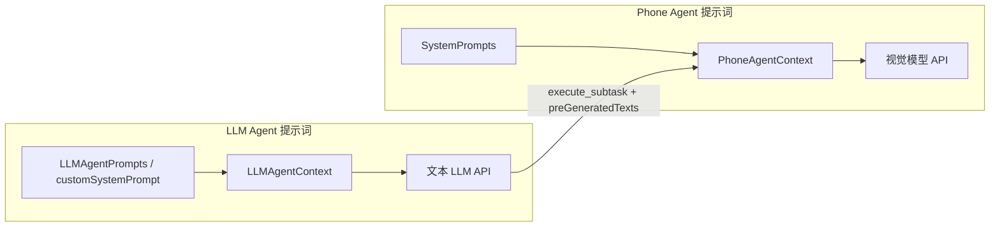
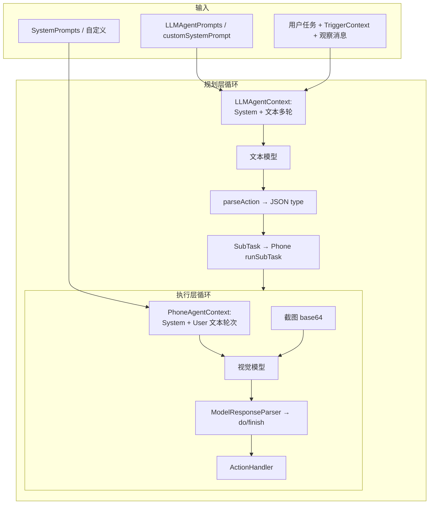

# Auto小二 提示词体系分析

本文说明项目中 **提示词如何存储、如何注入对话、如何与模型输出解析联动**，便于你分析「改哪里会改变什么行为」。

---

## 1. 总览：两套独立的 System Prompt 管线

本应用是 **双 Agent 架构**，对应 **两套互不混用** 的系统提示词（均支持中英、自定义、占位符替换）：

| 管线 | 作用对象 | 主要源码 | 调用的模型配置 |
|------|----------|----------|----------------|
| **Phone Agent（执行层）** | 带截图的多模态调用：理解当前界面并输出 `do(...)` / `finish(...)` | `config/SystemPrompts.kt` | `SettingsManager.getModelConfig()` → `ModelClient`（视觉 / Phone 模型） |
| **LLM Agent（规划层）** | 纯文本：拆解任务、下发子任务、日程 JSON、`finish` / `request_user` | `config/LLMAgentPrompts.kt` | `SettingsManager.getLLMAgentConfig()` → 独立的 `ModelClient` |

记忆口诀：**屏幕上的事靠 `SystemPrompts`；怎么分步、写文案、管日程靠 `LLMAgentPrompts`（或你填的 `LLMAgentConfig.customSystemPrompt`）。**



---

## 2. 提示词的「存放层次」

### 2.1 内存单例（进程内生效）

| 对象 | 文件 | 作用 |
|------|------|------|
| `SystemPrompts` | `SystemPrompts.kt` | `setCustomChinesePrompt` / `setCustomEnglishPrompt` 覆盖默认模板 |
| `LLMAgentPrompts` | `LLMAgentPrompts.kt` | 同上，针对规划层 |

用户在设置里保存自定义文案时，会 **同时** 写入 SharedPreferences **并** 调用上述 `setCustom*`，使当前进程立即生效。

### 2.2 持久化（冷启动）

| 数据 | `SettingsManager` 相关方法 | 说明 |
|------|---------------------------|------|
| Phone 自定义 System Prompt（中/英） | `getCustomSystemPrompt` / `saveCustomSystemPrompt` / `clearCustomSystemPrompt` | 键名内部用 `KEY_CUSTOM_SYSTEM_PROMPT_CN` / `_EN` |
| LLM 自定义 System Prompt（中/英） | `getLLMAgentCustomPrompt` / `saveLLMAgentCustomPrompt` / `clearLLMAgentCustomPrompt` | 与 `LLMAgentPrompts` 单例同步更新 |
| LLM 配置中的「整段覆盖」 | `getLLMAgentConfig().customSystemPrompt` | 从 prefs 读取 **当前界面语言对应的一条**（见 `isChineseLanguage()` 决定读 CN 还是 EN 键）；若非空，**优先于** `LLMAgentPrompts.getPrompt()` |

**应用启动时**（`AutoGLMApplication.loadCustomSystemPrompts()`）：

- 只会从磁盘 **恢复 Phone 层** 的 `SystemPrompts` 自定义内容。
- **不会**在这里调用 `LLMAgentPrompts.setCustom*`；规划层依赖 `ComponentManager` 创建 `LLMAgent` 时通过 `getLLMAgentConfig()` 读取 `customSystemPrompt`，或通过默认的 `LLMAgentPrompts.getPrompt(config.language)`（内置模板 + 占位符替换）。

若在代码路径上只改了 prefs、未同步单例，可能出现短暂不一致；正常 UI 保存流程会两者都更新。

---

## 3. Phone Agent：`SystemPrompts` 如何起作用

### 3.1 默认模板里有什么

- **角色与输出格式**：要求模型用 `<think>…</think>` + `<answer>…</answer>`（中文版明确写出）。
- **动作 DSL**：`do(action="Tap", …)`、`finish(message="…")` 等——与 `ActionParser` / `ActionHandler` 解析执行链路一致（见 `action/` 包）。
- **业务规则**：如自定义数字键盘用 `Batch`、微信搜索习惯、滑动失败重试等——直接影响 **视觉模型** 的规划方式。
- **坐标系**：统一 0–999 归一化坐标（与 `CoordinateConverter` 一致）。

### 3.2 占位符

- **`{date}`**：在 `getChinesePrompt()` / `getEnglishPrompt()` 中替换为当天日期（中英格式不同）。
- 自定义模板若保留 `{date}`，行为与默认一致；若删掉占位符，则失去「模型知道今天星期几」的上下文。

### 3.3 注入点：何时进入模型请求

1. `PhoneAgent.run()` 或子任务 `runSubTask()` 开始时，用 `SystemPrompts.getPrompt(config.language)` 新建 **`PhoneAgentContext(systemPrompt)`**。
2. `PhoneAgentContext` 在 `init` 和 `reset()` 时都把 **第一条消息固定为 `ChatMessage.System(systemPrompt)`**。
3. 每一步 `executeStep` 会追加 **用户侧文本**（**不带图存在消息结构里**），截图通过 `ModelClient.request(..., imageBase64)` **并行挂载在当前 user 轮次**。

首步用户文案示意（代码拼装）：

- 有任务：`任务: ${task}\n当前屏幕截图如下:`
- 后续：`上一步执行结果: ${hint}\n继续执行任务，当前屏幕截图如下:` 或 `继续执行任务，当前屏幕截图如下:`

因此：**System Prompt 定义「你是谁、输出什么格式、有哪些动作」；User 文本定义「当前任务句柄 + 是否截屏」——截图由 API 多模态字段传递，不堆在上下文文本里**（见 `PhoneAgentContext` 注释）。

### 3.4 与 `ModelResponseParser` 的契约

执行层模型返回的正文经 **`ModelResponseParser.parseThinkingAndAction`** 处理：

- 去掉 `<think>` / `<answer>` 标签外壳；
- 用括号平衡算法截取 **`do(...)`** 或 **`finish(...)`** 第一条合法动作；
-  thinking 为动作前的文本。

若你修改 `SystemPrompts` 却改用别的标签名或不用 `do`/`finish`，**解析会失败或拿到空 action**，进而触发重试或失败路径。**改 Prompt 时必须保持与解析器、ActionParser 的语法契约**。

### 3.5 LLM 下发的「预生成文字」如何进入 Phone 层

`LLMAgent` 解析 JSON 后构造 `SubTask(preGeneratedTexts = …)`。`PhoneAgent.runSubTask` 会调用 `buildEnhancedTaskDescription`，在子任务描述后追加：

- 中文：`【预生成内容——直接使用以下内容，不要自行生成】` + 逐条用途与正文；
- 英文：对应 `Pre-generated content — use verbatim…`。

这些文字进入 **第一步** 的 `任务: …` 字符串，相当于给 **视觉模型** 第二重指令：**打字内容已由规划层生成，执行层只需操作到输入框并 `Type` 指定文案**。这是 **跨两条提示词管线协作** 的关键设计。

---

## 4. LLM Agent：`LLMAgentPrompts` 如何起作用

### 4.1 默认模板核心内容

- **人格与边界**：「小二」人设、风险边界（支付、违法操作等）。
- **输出格式**：`<think>…</think>` + `<action>…</action>`，其中 **`<action>` 内必须是 JSON**（不是 Phone 那种 `do()` 字符串）。
- **JSON `type` 枚举**：`execute_subtask`、`schedule_task`、`query_scheduled_tasks`、`update_scheduled_task`、`delete_scheduled_task`、`finish`、`request_user` 等——与 `LLMAgent.parseAction()` 内 `when (type)` **强绑定**。

### 4.2 占位符（规划层）

| 占位符 | 替换时机 | 含义 |
|--------|----------|------|
| `{date}` | `getChinesePrompt()` / `getEnglishPrompt()` | 当天日期（中英格式不同） |
| `{time}` | 同上 | 当前时刻 `HH:mm` |
| `{date_example}` | 同上 | **明天**的 `yyyy-MM-dd`，给日程示例用 |

默认英文模板首行还直接写了 `Today is {date}, current time {time}`，与中文模板风格略有不同，但占位符机制一致。

### 4.3 `buildSystemPrompt()` 优先级

`LLMAgent.kt`：

```text
若 LLMAgentConfig.customSystemPrompt 非空 → 使用配置中的整段（来自 prefs，按语言键）
否则 → LLMAgentPrompts.getPrompt(config.language)（内置或单例自定义模板 + 占位符替换）
```

### 4.4 首轮用户消息 ≠ 只有「用户任务」

`buildInitialMessage(taskDescription, triggerContext)` 在「用户任务」前后还会拼接：

- **`LLMAgentPrompts.getCurrentDateTimePrefix(language)`**：如 `【当前时间】…` 或 `[Current time: …]`，强化时间推理（日程、定时）。
- **触发上下文**（若存在）：
  - **通知**：包名、标题、多条正文列表等原始字段；
  - **定时**：提醒这是「自己以前安排的日程」+ 备注；
  - **ClawBot**：微信来源说明 + `request_user` / `finish` 的配合说明；
  - **语音**：简单标注来源。

这些内容 **不在 System Prompt 里**，而是作为 **第一条 User 消息** 进入 `LLMAgentContext`，避免系统提示词过长、且可按触发类型迭代。

### 4.5 子任务结束后的「观察」消息

`buildObservationMessage` 把 `SubTaskResult` 格式化成结构化中文段落（成功/失败/需接管），作为 **新的 User 消息** 追加，驱动下一轮 ReAct。**改这里的模板会改变规划模型对失败的可解释性与Retry策略，而不改变 Phone 层视觉 Prompt。**

### 4.6 解析链：从原始文本到动作

1. **`extractThinking(rawContent)`**（见 `LLMAgent.kt`）  
   - 先调用 `extractBlock(rawContent, "think")`。`extractBlock` 用 `"<$tag>"` 拼接开标签，因此查找的是 **标签名为 `think`** 的闭合片段（Kotlin 中等价于尖括号内仅为字母 `think`，不包含 `redacted_` 前缀）。  
   - 默认规划模板（`LLMAgentPrompts`）要求模型输出 **标签名为 `redacted_thinking`** 的闭合片段。**二者不一致**，模型若严格按模板书写，第一分支通常匹配失败。  
   - 兜底逻辑：取 **第一个 `<action>` 之前** 的整段文本作为界面展示的「思考」内容；多数情况下思考区依赖该兜底。

2. **`parseAction(rawContent)`**  
   - 用 `extractBlock(..., "action")` 取 **第一个** `<action>...</action>` 内的子串，再按 **JSONObject** 解析 `type` 字段并分支（`execute_subtask`、`finish` 等）。

**与执行层的差异**：Phone 侧在 `SystemPrompts` 中使用 `<think>` / `<answer>`，`ModelResponseParser` 会剥掉这些标签后再解析 `do(...)` / `finish(...)`；规划侧使用 `<action>` 包裹 **JSON**，两套格式 **不要混用**。若你修改任一侧的提示词，请同时确认对应解析器仍能找到动作片段。

---

## 5. 其它「像提示词一样」影响模型的文本

这些不是 `SystemPrompts` / `LLMAgentPrompts` 文件里的内容，但 **形状上就是喂给模型的指令**：

| 来源 | 说明 |
|------|------|
| **用户输入框 / 任务模板** | 最终进入 `LLMAgent.run(description)` 或直连 `PhoneAgent.run`（若禁用双层则由产品逻辑决定，当前主线经 `TaskExecutionManager` 走 LLM）。 |
| **通知规则 `taskPrompt`** | `NotificationTriggerRule.taskPrompt` → 作为任务描述的一部分触发 LLM（见 `TriggerContext` + `buildInitialMessage`）。 |
| **定时任务描述** | 调度触发时同样作为任务描述进入规划层。 |
| **ClawBot 收到微信文本** | 转成任务描述 + `TriggerType.CLAWBOT` 附加说明。 |

---

## 6. 设置界面与代码入口（便于你对照改）

| 功能 | 界面/入口 | 持久化与内存 |
|------|-----------|--------------|
| Phone 系统提示词 | `SettingsFragment.showPhoneAgentPromptDialog`、`SettingsActivity` 中编辑 | `saveCustomSystemPrompt` + `SystemPrompts.setCustom*` |
| LLM 系统提示词 | `SettingsFragment.showLLMAgentPromptDialog` | `saveLLMAgentCustomPrompt` + `LLMAgentPrompts.setCustom*` |
| LLM API 与参数 | LLM Agent 设置对话框 | `saveLLMAgentConfig`；重建 agent 见 `ComponentManager.reinitializeAgents()` |

修改 Phone 的 **语言** `PhoneAgentConfig.language` 会切换 `SystemPrompts.getPrompt(en/cn)`，与界面语言可能独立，需在设置里对照。

---

## 7. 提示词如何「发挥作用」— 因果链小结



**一句话**：System 侧 Prompt 决定 **能力边界与输出语法**；User 侧动态文本决定 **当前任务与反馈**；解析器 **硬编码** 了与 Phone DSL、LLM JSON 的契约——调 Prompt 时三者要一起考虑。

---

## 8. 实战调优方向（与提示词分析相关）

1. **只换模型不换 Prompt**：若新模型不遵守 `<answer>`/`do()` 或 JSON `type`，会出现空 action、解析失败；优先在 **对应 System Prompt** 里加 few-shot 或收紧格式说明。
2. **缩小战场**：日程、微信、通知相关行为既可改 **LLMAgent 默认模板**，也可改 **`buildInitialMessage` / `buildObservationMessage`**（代码层「动态提示」）。
3. **安全与合规**：风险条款写在 LLM 侧模板；执行危险 UI 仍依赖视觉模型与 `Tap` 的 `message="重要操作"` 等——**均为软约束**。
4. **中英文两套模板**：修改时记得 **两套同步**或明确只服务中文场景，否则切换语言后行为漂移。

---

## 9. 关键文件索引

| 主题 | 路径 |
|------|------|
| Phone 默认/自定义系统提示词 | `app/.../config/SystemPrompts.kt` |
| LLM 默认/自定义系统提示词 | `app/.../config/LLMAgentPrompts.kt` |
| 规划层消息拼装与解析 | `app/.../agent/LLMAgent.kt` |
| 执行层上下文与步骤用户文案 | `app/.../agent/PhoneAgent.kt`、`PhoneAgentContext.kt` |
| 执行层响应解析 | `app/.../model/ModelResponseParser.kt` |
| 持久化 | `app/.../settings/SettingsManager.kt` |
| 启动加载 Phone 自定义 | `app/.../app/AutoGLMApplication.kt` |

---

*文档随代码演进可能需更新；若与实现不一致，以对应 `.kt` 源文件为准。*
